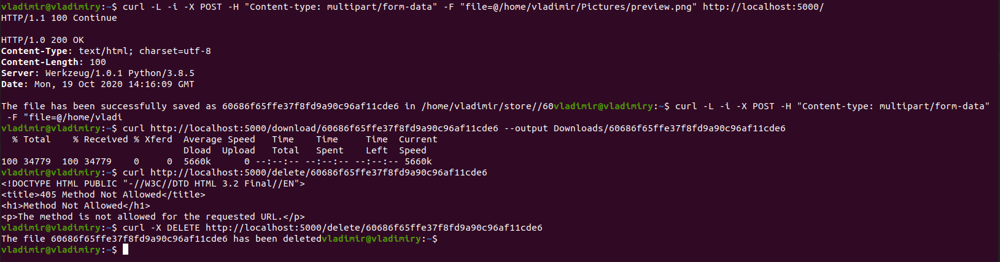

# Local file storage 

## Introduction
This is a local file storage with HTTP API.
You can download, upload and delete files using GET, POST and DELETE methods.
When you upload a file, the name will be replaced with a hash.

## How to use
After cloning the repo, you need to add and activate python virtual environment:
- `python3 -m venv venv`
- `pip install -r requirements.txt`
- `source venv/bin/activate`

#### How to run
You can run it as a Flask app using the following command:
- python app.py

Or you can run it as a daemon on your system.

There are to options:
1) Use this command to run: `sudo nohup flask run > log.txt 2>&1`, after using this command you will get a PID. 
To stop a daemon use `kill -9 PID`.
2) Run `run_server` bash script.
 
##### How bash script works
- It copies `file_storage.service` to `/etc/systemd/system/` 
- It allows to run, stop and check the status of a daemon.

Use the following commands:
- to start a daemon: `./run_server start`
- to stop a daemon: `./run_server stop`
- to check the status: `./run_server status`

After running the server, you can use the web-interface or curl:

